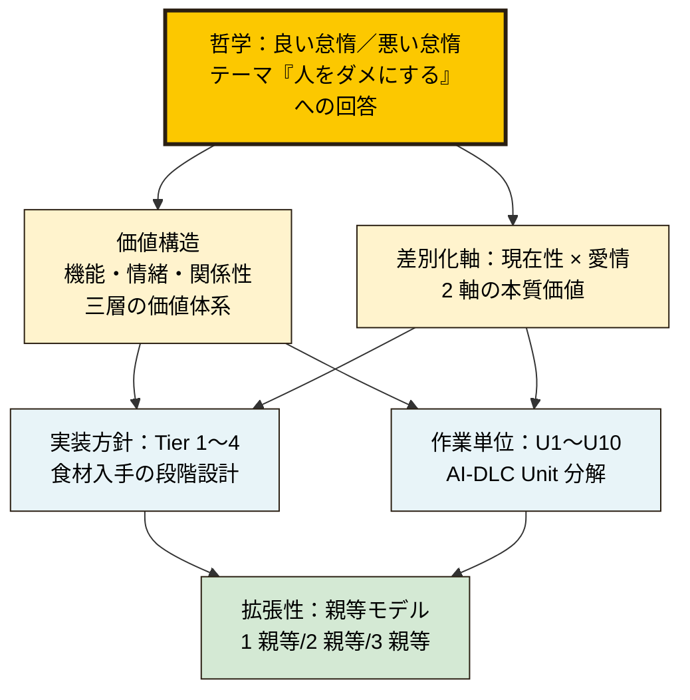
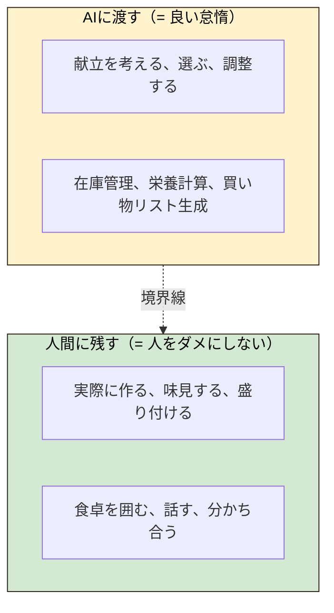

# うちごはん

> **サボるほど、食卓が笑う。**
> 思考はAIに、味付けは愛で。

[](https://aws.amazon.com/jp/summits/japan/)
[](https://zenn.dev/aws_japan/articles/aidlc-workflows)
[](LICENSE)
[]()

AWS Summit Japan 2026 AI-DLC ハッカソン提出物。  
共働き家庭の「今日何作ろう」を考えなくする献立AI。家族の冷蔵庫・仕事疲労・体調をリアルタイム統合し、親等モデルで親世帯・兄弟まで自然に拡張します。

---

## Why うちごはん

みなさん、子供との時間、もっと欲しくないですか？
家族との時間、両親との時間、作れていますか？
部下や先輩との時間、ちゃんと取れていますか？

家族との団欒は、プライスレス。
離れた両親を思いやれることは、親孝行。

これが、自動で集約できる「怠惰」なら ── 最高ですよね？

**うちごはん。サボるほど、食卓が笑う。**

---

## テーマ再解釈

本ハッカソンのテーマ「**人をダメにする**」を、私たちは「**サボらせる**」として再解釈しました。  
ダメにしていい部分（思考・選択・調整）と、ダメにしてはいけない部分（料理・食卓・愛情）を意図的に分けて設計します。

---

## うちごはんの本質：家族の "今日" を可視化するレイヤー

うちごはんが直接担う領域は、ただ 1 つです：
**「今日の、あなたの家族」を、会話と健康データから可視化すること**

これは現在、どのサービスも担っていない領域です。

- 既存の栄養管理サービスは、個人の栄養は見ますが、家族の "今日" は見ません
- 既存のレシピサービスは、レシピは見せますが、家族の "今日" は見ません
- 既存の食材配送サービスは、食材は届けますが、家族の "今日" は見ません

うちごはんは、この "誰も担っていない領域" を担うサービスです。
その先で、栄養・レシピ・食材調達など各専門領域のサービスと
連携する構造を構想しています。ただし、これらの連携は相手の合意を
前提とするものであり、Inception 段階の本書類では連携先を断定せず、
**構想段階の構造提案** として位置づけます。

### 自前で勝負する 2 つの本質的価値

| 価値軸 | 内容 |
|---|---|
| **現在性** | 今日の体調・疲労・在庫を、会話と健康データから推定し統合 |
| **愛情** | 作るのはあいかわらず家族。AI が引き受けるのは思考だけ |

### うちごはん自身に課す自戒

うちごはんはユーザーに「良い怠惰」を提供しますが、
私たち自身は「悪い怠惰」── 相手の合意なしに連携を語る思考停止 ──
に陥らないよう自戒します。
連携は、相手にも価値が生まれる構造でのみ実現を目指します。

### フレーム階層

うちごはんは複数のフレームを持ちますが、中核は **「良い怠惰／悪い怠惰」**
の哲学です。他のフレームはその哲学の異なる側面の具体化です。



各フレームの詳細は本書類および aidlc-docs/ 配下のドキュメントを参照ください。

---

## 設計思想：良い怠惰／悪い怠惰



ナッシュ等の冷凍宅配は「料理」を代行します。
うちごはんは「考える疲れ」だけを代行します。
作る人が、家族のままでいられるように。

---

## ドキュメント

提出物の本体は [aidlc-docs/](aidlc-docs/) 配下にあります。

| ファイル | 内容 |
|---|---|
| [aidlc-docs/README.md](aidlc-docs/README.md) | サービス概要・設計思想・ファイル索引 |
| [aidlc-docs/01-requirements-analysis.md](aidlc-docs/01-requirements-analysis.md) | 要件分析（背景・課題・価値提案・成功指標） |
| [aidlc-docs/02-user-stories.md](aidlc-docs/02-user-stories.md) | ペルソナ3名 × ユーザーストーリー（ビフォー/アフター物語付き） |
| [aidlc-docs/03-application-design.md](aidlc-docs/03-application-design.md) | アプリケーション設計（LINE Bot軸・Tier構造・AI×Human境界） |
| [aidlc-docs/04-unit-decomposition.md](aidlc-docs/04-unit-decomposition.md) | Unit分解（10 Units、U10は意図的にAI比率0%） |
| [aidlc-docs/business-context.md](aidlc-docs/business-context.md) | ビジネス文脈（競合・収益モデル・API規約・リスク） |
| [PROJECT_BRIEF.md](PROJECT_BRIEF.md) | プロジェクト全体サマリ |
| [DECISIONS_AND_OPEN_QUESTIONS.md](DECISIONS_AND_OPEN_QUESTIONS.md) | 決定事項と未決事項のロックドキュメント |

---

## キャッチコピー体系

```
【メインキャッチ】 サボるほど、食卓が笑う。
【サブコピー】    思考はAIに、味付けは愛で。
【設計思想】      愛情を守る、良い怠惰。
```

---

## ライセンス

[MIT License](LICENSE)
