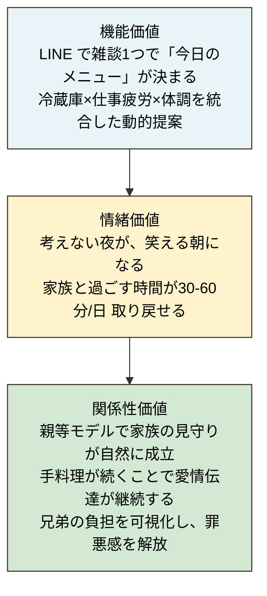

# 01. 要件分析

## 1. 背景：なぜ今「うちごはん」なのか

### 1.1 社会課題のデータ

| 指標 | 数値 | 出典 |
|---|---|---|
| 仕事を持ちながら育児中の女性 | **75.9%（過去最高）** | 厚生労働省 国民生活基礎調査 2022 |
| 共働き既婚女性のワンオペ育児該当率 | **52.0%** | 厚労省関連調査 |
| 育児ストレス「あり」 | **91.7%** | キッズライン調査 |
| 育児中の最大の悩み「自分の時間がない」 | **53.5%** | 同上 |
| 嫌いな家事ランキング上位常連 | **料理（特に下ごしらえ）** | マイナビ／神戸新聞ほか |
| 50代女性の困りごと1位 | **物価・光熱費が高い** | ハルメク 2025 |
| 介護と仕事の両立不安 | **82.2%** | マネジー 2025 |
| ビジネスケアラー経済損失試算 | **9.1兆円(2030)** | 経済産業省 |
| 1日の食事意思決定回数 | **約226回** | コーネル大学研究 |
| 献立思考の年間時間 | **約122時間/年**（20分/日×365日） | 各種家事代行調査からの推計 |

### 1.2 現代の構造的問題

1. **共働き化の不可逆な進行**：仕事を持つ既婚女性は7割超、男女問わず帰宅後は疲労困憊
2. **献立疲労（Decision Fatigue）**：1日の食事意思決定回数は226回。退勤後の「今日何作る？」は最大の認知負荷
3. **介護世代の重なり**：団塊世代が2025年に全員75歳到達。子世代（40-50代）は仕事と親の介護のダブル負担
4. **3世代統合の不在**：自分・子・親の食事情報が断絶しており、家族単位の見守りができない
5. **「楽」の代償**：ナッシュ等の冷凍宅配は普及したが、手料理の機会が減ることで家族の食卓・健康・関係性が薄まる懸念
6. **AI完全代替時代の問い**：技術的には何でも代替できる時代に「あえて代替しない領域」をどう設計するか

---

## 2. 課題（Problem Statement）

### コア課題

> 共働き世帯の料理担当者は、退勤後の疲労困憊状態で**「今日何を作るか」を考えること自体が最大の負担**になっている。  
> 一方、手料理を完全に放棄すると、家族の健康・絆・心のケアが損なわれる。

### サブ課題

- **A. 献立疲労**：冷蔵庫を眺めて15-30分立ち尽くす。同じメニューの繰り返し
- **B. 体調・栄養との不整合**：疲労時ほど栄養が偏る。家族の体調変化に対応できない
- **C. 親世帯の見守り断絶**：離れた実家の親が何を食べているか分からない、心配だが頻繁に確認できない
- **D. 介護世代の罪悪感**：親への手料理伝授・電話・訪問の機会を作れない
- **E. 兄弟間の負担不均衡**：主たる介護担当が一方的に背負い、他兄弟は罪悪感
- **F. 既存サービスのトレードオフ**：完全外注（ナッシュ）= 愛情消失／完全自前 = 消耗

---

## 3. ターゲットユーザー

### 主役：共働き家庭の料理担当者（30-40代）

**典型像**：田中 美咲（32歳、女性）— 詳細は[02-user-stories.md](./02-user-stories.md)参照
- 都内勤務、5歳の子1人、夫も会社員
- 平日19時頃帰宅、ヘトヘトで冷蔵庫の前で立ち尽くす
- 「ちゃんとした母親でいたい」プレッシャー強い
- 千葉郊外の実家の母（62歳）も気になっている

### 家族範囲：親等モデルで自然拡張

| 親等 | 例 | 関与度 |
|---|---|---|
| 1親等 | 配偶者・子・親 | 共同編集者、詳細閲覧 |
| 2親等 | 兄弟・祖父母 | サマリのみ閲覧者 |
| 3親等 | 叔父・甥姪 | 安否情報のみ（緊急時通知） |

### B2B買い手：企業福利厚生・健康保険組合

- 大企業の福利厚生部門（共働き支援、ビジネスケアラー支援）
- 健康保険組合（健康経営、医療費削減）
- 自治体（高齢者見守り、介護予防）

---

## 4. 価値提案（Value Proposition）

### 中心メッセージ

> **サボるほど、食卓が笑う。**
> 思考はAIに、味付けは愛で。

### 提供価値の三層

**機能価値**：
家族の体調・疲労・在庫を会話と健康データから推定し、今日の献立を絞り込む。
**現在性**（今日の最適解、過去の平均基準ではなく）が中核機能。
レシピ提案・栄養計算・食材調達などは、専門サービスとの連携を構想していますが、
本書類段階では擬似データまたは公開 API での実装を前提とします。

### 既存サービスとのポジション関係

各専門サービスは、それぞれの領域で長年の蓄積を持っています。
うちごはんは、これらの専門サービスがまだ手付かずの "家族×今日" の
レイヤーを担い、各専門領域とは将来的な連携を構想します。

| サービス | 主な強み | うちごはんとの関係 |
|---|---|---|
| ナッシュ・宅配弁当 | 栄養トータルマネジメント、完全代行 | 補完関係（料理を奪わない選択） |
| Oisix・コープ定期便 | 計画的配送、食材の品質 | 補助救済としてリンク提供 |
| クラシル・DELISH KITCHEN | 豊富なレシピ、UGC の多様性 | 連携を構想（API 公開時） |
| あすけん等栄養管理 | 栄養計算の専門性、膨大な食品 DB | 連携を構想（家族文脈での再利用） |
| 楽天レシピ | 公開 API、商用利用可 | API 経由で実装中（規約遵守） |
| **うちごはん（提案）** | **家族×今日の可視化と統合レイヤー** | （Inception 段階、MVP で検証予定） |

### 自前で勝負する 2 つの本質価値

うちごはんが直接担うのは、2 つの本質価値の同時保護です：

| 価値軸 | 内容 |
|---|---|
| **現在性** | 今日の体調・疲労・在庫を、会話と健康データから推定し統合 |
| **愛情** | 身内が作る料理という事実を保護（"今日のあなた" を想って作られた料理） |

副次的便益として、AI が「考える疲れ」を引き受けることで、
作り手に新しいレシピに挑戦する余裕が生まれます。ただし、これは
中核価値ではなく現在性の派生効果として位置づけます。

栄養データ・レシピ・食材調達など各専門領域については、
既存サービスの優位性を認め、将来的な連携を構想しますが、
本書類段階では合意未取得の構想として扱います。

---

## 5. Why Now：今やる理由

1. **生成AIの実用ライン到達**：Bedrockのマルチモーダルで「冷蔵庫写真→食材認識→献立生成」が現実的精度
2. **AI完全代替時代の問い直し**：「全部AIにやらせる」が技術的には可能になった今こそ、「**意図的に残す領域**」の設計が差別化になる
3. **2025年問題の到来**：団塊全員後期高齢者で、介護×仕事の両立が国家課題に
4. **共働き比率の上限到達**：共働き既婚女性75.9%は構造化された前提に。一時的問題ではない
5. **LINEの全世代浸透**：親世代も含めてLINEでの自然対話が成立する成熟期に達した
6. **AWS Summit Japan 2026のテーマ「人をダメにする」**：本サービスは「ダメにしていい部分」と「ダメにしてはいけない部分」を区別する設計思想で、テーマの本質を捉える

---

## 6. ゴール / ノンゴール

### ゴール（やること）

- LINE 雑談で当日メニューが届く
- 冷蔵庫の中身を最小入力負荷で把握（写真送信のみ）
- 家族の体調・好み・予定をAIが自動考慮
- 親等モデルで家族間の食情報共有
- 月次の栄養傾向レポート（Phase 2）

### ノンゴール（やらないこと）

- 料理代行（手料理の価値を守るため、調理は人間に残す）
- 冷凍弁当販売（既存プレイヤーがいる）
- 完全自動発注（家族の意思決定を奪わない範囲に留める）
- 医療診断（要配慮個人情報のため、月次レポートはあくまで傾向把握）
- リアルタイム動画認識（プライバシー懸念、写真ベースで十分）
- レシピ自前生成（既存レシピサイトに送客、共生型エコシステム）

---

## 7. 成功指標（KPI）

### Phase 1（MVP / 5/30予選用）

| 指標 | 目標 |
|---|---|
| LINE雑談からメニュー受信まで | **20秒以内** |
| 冷蔵庫写真1枚での食材認識精度 | **5品目以上、80%以上** |
| メニュー受諾率（提案を実際に作った率） | **70%以上** |
| 献立を考える時間の削減 | **15分→1分以下** |
| 親世帯食卓連動の成立 | 美咲↔雅子 1往復以上 |

### Phase 2（決勝 / 6/26）

| 指標 | 目標 |
|---|---|
| 親世帯との食情報共有設定の容易さ | **3タップ以内で完了** |
| 親等別アクセス権の正確性 | **100%（誤公開ゼロ）** |
| 家族メンバー間の通知到達率 | **95%以上** |

### 事業化フェーズ

| 指標 | 目標 |
|---|---|
| 月次アクティブ利用率 | 70%以上 |
| ユーザーの「家族と過ごす時間」体感増加 | 30分/日以上 |
| 解約率 | 5%/月以下 |

---

## 8. 制約条件

- **技術**：AWSサービス利用必須、AI-DLC（AI-Driven Development Life Cycle）メソドロジー準拠、LINE Messaging API利用前提
- **チーム**：2名構成、IoT/ハード自作は不得意領域
- **時間**：書類審査5/10、予選5/30、決勝6/26
- **法令**：要配慮個人情報（健康診断結果）の取扱い、医師法の越境禁止
- **倫理**：家族監視ではなく「ゆるやかな見守り」、親世代の同意UIを必ず実装
- **API規約**：楽天ウェブサービスは商用展開時に楽天アフィリエイト連携必須（[business-context.md](./business-context.md)参照）
