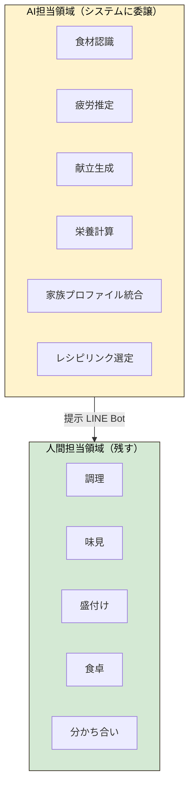
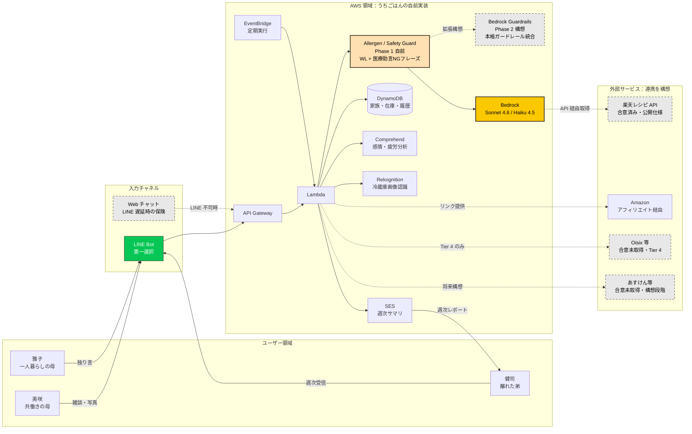

# 03. アプリケーション設計

## 設計原則：AI×Humanの境界線

うちごはんのアーキテクチャは「**AIに渡す領域**」と「**人間に残す領域**」を明示的に分けるよう設計されています。これは単なる実装の都合ではなく、サービスの哲学そのものです。



**重要な設計判断**：U10「料理することは、サボらない」のAI関与度は **0%** に設定されています。料理を作る時間こそ、人間に残すべき愛情の源泉だからです。

---

## 入力チャネル：LINE Bot 軸

第一選択は **LINE Messaging API**。日本国内の圧倒的リーチ、親世代でも使える日常UI、過去優勝のKanpAi(電話)と同じく**日常の通信路に侵入する**勝ちパターンを採用します。

- ユーザーは新しいアプリをインストールしない
- 親世代も既存のLINE体験のまま使える
- 発言・スタンプ・写真送信といった既存UIをそのまま機能ハンドルにできる

**保険**：LINE申請が予選までに完了しないリスクに備え、独自Webチャット（CloudFront + S3 + Lambda）をフォールバックとして用意。

---

## システム全体アーキテクチャ

実線はうちごはんが自前で実装する経路、点線は外部サービスとの連携経路または保険経路です。
合意未取得の連携先（Oisix、あすけん等）と LINE 申請遅延時の自前 Web チャットは破線スタイルで明示しています。



LINE 申請が予選までに完了しないリスクに備え、独自 Web チャット（CloudFront + S3 + Lambda）を
フォールバックとして用意します。Web チャットは LINE Bot と同じ API Gateway を入口に使うため、
バックエンドの実装は変更なく差し替え可能な構造です。各データソースの合意状態の詳細は
本文書の「データソースに関する注記」を参照ください。

---

## 食材入手 Tier 構造

ユーザーの状態に応じて、AI が提案する食材入手手段を4段階で切り替えます。

| Tier | 状況 | 入手方法 | AI提案優先度 |
|---|---|---|---|
| **Tier 1** | 通常 | 冷蔵庫の在庫だけで完結 | ◎ 第一推奨 |
| **Tier 2** | 1〜2品の不足 | 帰り道に買うものリスト提示 | ○ 標準 |
| **Tier 3** | 動きたくない疲労時 | 食材EC（Amazon Fresh / 楽天市場 等）へリンク | △ 提案するが控えめ |
| **Tier 4** | 限界・最終救済 | 出来合い系（弁当宅配・コンビニ）リンク | ✕ AIから能動的に提案しない |

**重要原則**：Tier 4 は**消さずに残す**（逃げ道のある優しさ）が、**AI からは積極的に提案しない**（哲学保護）。ユーザーが「今日は無理」と意思表示した時のみ表示。

```
[ユーザー疲労度]
     ↓
[AI判定]
     ↓
  ┌──┴──┐
  │     │
Tier 1-2  Tier 3
(通常)   (疲労MAX時)
                   ↓
                 ユーザー操作で
                 Tier 4 開示
```

---

## 親等モデル

| 親等 | 例 | 可視性 |
|---|---|---|
| 1親等 | 美咲 ⇄ 雅子 ⇄ 美咲の子 | 詳細閲覧（食事内容、薬、体調） |
| 2親等 | 美咲 ⇄ 健司 | サマリのみ |
| 3親等 | 健司 ⇄ 雅子 | 安否のみ（緊急時通知のみ） |

実装は DynamoDB のアクセス制御で表現。各 Item に `visibility_level` フィールドを持たせ、参照時にユーザーの親等に応じてフィルタリング。

---

## データモデル（主要エンティティ）

### User
```
- userId (PK)
- name
- birthDate
- familyTreeId (家族グループへの参照)
- lineUserId (LINE Messaging API用)
- healthProfile { 体重、アレルギー、慢性疾患フラグ等 }
- preferenceProfile { 好き嫌い、苦手食材、よく食べる料理ジャンル }
- consentSettings { 各機能のオプトイン状態 }
```

### FamilyRelation（別テーブル分離）
```
- relationId (PK)
- fromUserId
- toUserId
- relationDegree (1=1親等, 2=2親等, 3=3親等)
- visibilityScope (詳細/サマリー/安否のみ)
- approvedAt
- approvedBy
```

**設計ポイント**：双方向の同意モデル。Aが「Bに公開」と設定するだけでなく、Bが「Aから見られることを承認」する2段階フロー。

### Fridge
```
- fridgeId (PK)
- ownerUserId
- items: [{ name, quantity, registeredAt, estimatedExpiry }]
- lastSnapshotPhotoS3Url
- lastSnapshotAt
```

### DailyContext
```
- contextId (PK)
- userId
- date
- inferredFatigueScore (1-10、LINE発言から推定)
- workSchedule { 帰宅予定時刻、残業フラグ }
- weatherSnapshot
- familyAttendance { 夫: 在宅/不在、子: 通常 }
- generatedMenuCandidates: [3案]
- selectedMenu { name, recipeUrl, missingIngredients }
- feedback { 作った/作らなかった、感想 }
```

### NutritionLog（Phase 2）
```
- logId (PK)
- userId
- date
- mealType (朝/昼/夜)
- photoS3Url
- aiAnalysis { 推定カロリー、塩分、たんぱく質等 }
- monthlyAggregateRef
```

### MonthlyReport（Phase 2）
```
- reportId (PK)
- userId
- yearMonth
- nutritionTrend
- adviceText (Bedrock生成、医療助言を避けたフレーズ統制)
- pdfS3Url
- sharedWithUserIds (公開範囲に応じた配布先)
```

---

## 主要ユースケースのフロー

### Flow 1: LINE雑談 → 体調推定 → 候補メニュー先行生成

```
[User] → LINEに「今日疲れた…」と発言
         ↓
[LINE Webhook] → API Gateway → Lambda
         ↓
[Lambda: ContextIngestor]
  - DynamoDBに発言ログ保存
  - 過去24h発言を集約
         ↓
[Bedrock Haiku 4.5] ← 疲労度推定（「過去発言から疲労度1-10で出力」）
         ↓
[DynamoDB] ← inferredFatigueScore更新
         ↓ (退勤前トリガーで)
[Lambda: MenuCandidateGenerator]
  - Fridgeデータ取得
  - HealthProfile取得
  - 楽天レシピAPI呼び出し（カテゴリ別ランキング、TTL 3h）
  - Bedrock Sonnetに統合プロンプト送信
  - 候補3案＋楽天レシピリンクを生成
```

### Flow 2: 退勤前 → LINEで確定メニュー通知

```
[EventBridge] → カレンダー終了10分前トリガー
         ↓
[Lambda: MenuFinalizer]
  - 朝に生成した候補から最適1案を選定
  - 不足食材リストを生成（Tier 1-4 判定）
  - LINE Messaging APIでプッシュ通知
         ↓
[User] → LINEで「これにする」スタンプ or テキスト
         ↓
[LINE Webhook] → Lambda: MenuConfirmer
  - selectedMenuを確定
  - 楽天レシピへのリンクを再送（調理開始用）
```

### Flow 3: 冷蔵庫写真登録（LINE経由）

```
[User] → LINEで冷蔵庫写真を送信
         ↓
[LINE Webhook] → Lambda
         ↓
[S3] ← LINE Content APIから画像取得して保存
         ↓
[Lambda: FridgeRecognizer]
  - Bedrock Vision で食材一覧を抽出
  - Rekognition Custom Labelsで精度補強（補助）
  - 賞味期限を品目別ヒューリスティックで推定
  - DynamoDBに更新
         ↓
[LINE] ← 「以下の食材を登録しました：鶏むね、豆腐、ニラ…」と返信
[User] → 必要に応じて「ニラじゃなくてネギ」と修正
```

### Flow 4: 親世帯食卓連動（U7、Phase 1必須）

```
[美咲: メニュー確定]
         ↓
[Lambda: FamilyMenuPropagator]
  - 雅子の冷蔵庫データ取得
  - 同じメニュー or 雅子向けアレンジ（塩分控えめ等）を生成
  - 雅子のLINEに提案
         ↓
[雅子: 食卓写真を任意送信]
         ↓
[Lambda: TableShareNotifier]
  - 美咲のLINEに通知（「今日、同じごはん食べたよ」）
  - 美咲側の食卓写真も任意で雅子に送信
```

### Flow 5: 親等別の家族閲覧

```
[Family Member (健司)] → 母の状態を確認したい
         ↓
[LINE: 「お母さん最近どう？」]
         ↓
[Lambda: FamilyVisibilityResolver]
  - 健司の親等を確認（雅子から見て3親等扱い、または2親等弟）
  - 雅子の公開設定を確認
  - 親等に応じたサマリーを返却
         ↓
[健司] ← 「今週の田中雅子さん：食事7日中6日完食、塩分基準内…」
```

---

## AI/プロンプト設計の核

### MenuCandidateGenerator のプロンプトテンプレート（疑似）

```
あなたは「うちごはん」AIアシスタントです。
共働きの料理担当者の今日の夕食メニューを1案＋代替2案で提案してください。

【ユーザー状態】
- 推定疲労度（過去24h LINE発言から）: {fatigueScore}/10
- 帰宅予定時刻: {expectedHomeTime}
- 残業フラグ: {overtimeFlag}

【家族】
- 配偶者の在宅: {spousePresent}
- 子のアレルギー: {childAllergy}
- 苦手食材: {dislikedFoods}

【冷蔵庫】
{fridgeItems}（賞味期限近い順）

【今日の天気】
- 気温: {temperature}, 天候: {weather}

【楽天レシピAPI候補】
{rakutenRecipes}（カテゴリ別ランキング上位）

【制約】
- 調理時間は疲労度に応じて調整（疲労度8以上は15分以内）
- 賞味期限が近い食材を優先利用
- 子のアレルギー・苦手食材を絶対回避
- 過去7日と被らないジャンルを優先

【出力形式（JSON）】
{
  "main": { "name": "...", "cookTime": "...", "reason": "...", "rakutenRecipeUrl": "...", "missingIngredients": [], "tier": 1 },
  "alternatives": [
    { "name": "...", "cookTime": "...", "reason": "...", "rakutenRecipeUrl": "...", "tier": 2 },
    { "name": "...", "cookTime": "...", "reason": "...", "rakutenRecipeUrl": "...", "tier": 1 }
  ]
}
```

---

## LINE Bot UX 設計（メッセージサンプル）

### 1. 退勤前のメニュー提案
```
お疲れさま。今日は冷蔵庫の鶏むね・豆腐・ニラだけで作れる、
楽天レシピ「塩レモン鶏炒め」を見つけたよ。15分で完成。
買い物ゼロで完結します。

📖 レシピを見る → [楽天レシピのURL]

これでいい？
[👍 OK] [🔄 別の案] [🌙 全部おまかせ]
```

### 2. 親世帯連動通知
```
お母さんも今朝『野菜食べたい』と言ってたので、
千葉のキッチンにも同じ献立を提案しました。
```

### 3. 雅子（母）への提案
```
おはよう雅子さん。寒いね。
今日は温かい煮物どうですか。冷蔵庫の大根と鶏で15分。
美咲ちゃんも今夜、同じ献立を提案しました。
お薬の時間と食事を合わせると19:30が良さそうです。
```

### 4. 健司（弟）への週次サマリ
```
今週の田中雅子さん：
✅ 食事7日中6日完食
✅ 塩分基準内
✅ 薬時間±15分以内
✅ 姉・美咲との食卓連動5日
✅ 睡眠リズム良好

詳細はプライバシー保護のため非表示。
悪い知らせがあれば即時通知します。
```

---

## 非機能要件

| 項目 | 要件 |
|---|---|
| レスポンス | LINE発言からBot応答まで5秒以内 |
| 可用性 | 99.5%（家族の安否確認系は99.9%） |
| プライバシー | 写真は90日後自動削除、健康データはユーザー削除権 |
| 個人情報 | 健康診断情報はAmazon Comprehend Medicalの匿名化を経由（Phase 2） |
| 多言語 | 日本語のみ（Phase 1）。海外展開時は英語追加 |
| デバイス | LINE Messaging API経由のため、LINE対応端末すべて |

---

## ガードレール設計

要配慮個人情報（健康データ、アレルギー）と AI 出力の安全性を担保するため、
うちごはんは AI 入出力に対する **段階的ガードレール** を設計します。
うちごはんの哲学「良い怠惰／悪い怠惰」を書き手側にも適用し、
「実装します」と断言せず、Phase 1 で確実な最低限を自前実装し、
Phase 2 で AWS マネージドサービスへの統合を目指します。

### 4 層のガードレール構造

| 層 | 役割 | 実装位置 | Phase |
|---|---|---|---|
| 1. 家族プロフィール参照 | AI 入力時にユーザーの健康フラグ・アレルギー・苦手食材をプロンプトに注入 | Lambda（プロンプト構築段） | Phase 1 自前実装 |
| 2. AI 出力後の NG 食材チェック | AI 提案レシピを楽天レシピ ID で参照し、家族のアレルギー・苦手食材を含むものを除外（ホワイトリスト方式） | Lambda（後処理） | Phase 1 自前実装 |
| 3. 医療助言禁止フレーズ統制 | 月次レポート等の出力テキストから「診断」「処方」「治療」等の禁止語彙を正規表現／LLM フィルタで除外 | Lambda（後処理）+ Bedrock プロンプト統制 | Phase 1 自前実装 |
| 4. Bedrock Guardrails 統合 | AWS Bedrock のネイティブガードレール機能を統合し、安全性管理を AWS マネージドに委譲 | Bedrock | **Phase 2 構想・本実装を目指します** |

### Phase 1 MVP の最低限の保護

書類審査・予選 MVP 段階では、層 1〜3 を自前実装で最低限カバーします：

- **層 1（プロンプト注入）**：DynamoDB の `healthProfile.allergies` と `preferenceProfile.dislikedFoods` を毎回プロンプトに含める
- **層 2（食材ホワイトリスト）**：楽天レシピ API の `recipeIngredient` フィールドを取得し、アレルギー食材が含まれないことを照合
- **層 3（医療助言フレーズ統制）**：プロンプトテンプレートに「診断・処方助言は行わない」を明記、出力後に禁止フレーズの存在を再チェック

### Phase 2 で本実装を目指すもの

- **層 4（Bedrock Guardrails）**：AWS Bedrock の Guardrails 機能を用いて、AI 出力の安全性ポリシー（医療助言、誤情報、有害コンテンツ）を AWS マネージドサービスで一元統制する構造を設計します。Phase 1 では本機能を統合せず、自前の層 1〜3 で最低限の保護を担保します。

### 「悪い怠惰」を避けるガードレール思想

うちごはんの哲学に従い、書き手側も「AI に全てを任せた」と
言わない構造を取ります。AI 出力の正しさは、AI 自身ではなく、
**入力時の人間ルール（家族プロフィール）** と
**出力時の人間ルール（ホワイトリスト・禁止フレーズ）** で
担保する設計です。Bedrock Guardrails の統合は Phase 2 構想であり、
それまでは自前ガードで責任を引き受けます。

---

## セキュリティ・コンプライアンス

- **認証**：LINE User IDをCognito連携、家族関係カスタム属性で管理
- **暗号化**：全通信TLS 1.3、保存時KMS暗号化
- **個人情報保護法**：要配慮個人情報（健康データ）はオプトイン明示
- **医師法対策**：栄養レポートは「傾向把握」に留め、診断・処方助言は行わない
- **家族間の同意**：親等別公開は双方向承認、未成年データは親権者同意
- **写真の取扱い**：冷蔵庫内写真は食材抽出後に元画像を削除可（オプション）
- **API規約**：楽天ウェブサービスはアフィリエイトPG加入時のみ商用利用可（[business-context.md](./business-context.md)参照）

---

## 技術選定の理由

| 技術 | 選定理由 |
|---|---|
| **LINE Messaging API** | 日本国内リーチ、親世代対応、新規アプリ不要 |
| Amazon Bedrock (Claude Sonnet 4.6) | 献立推論・家族最適化に推論力必要、マルチモーダル＋日本語精度 |
| Amazon Bedrock (Claude Haiku 4.5) | 疲労度推定など軽量タスク、コスト1/4・レイテンシ半分 |
| 楽天レシピAPI | 公式・無料・商用OK（アフィリエイトPG加入時）、レシピ自前生成不要 |
| DynamoDB | 家族×日次ログのアクセスパターンが単純キーで効率的 |
| EventBridge | 時間トリガーと業務イベント駆動を統一管理 |
| Cognito | 家族関係はカスタム属性、ユーザープール分離可 |
| Comprehend Medical | Phase 2で健康データの匿名化・標準化を実施 |

---

### データソースに関する注記

本設計で参照する外部サービス／データ：

| データソース | 利用形態 | 合意状態 |
|---|---|---|
| 楽天レシピ API | 公開 API、規約準拠で利用 | 合意取得済み（規約遵守） |
| Amazon | アフィリエイト経由のリンク | アフィリエイト PG 加入予定 |
| Oisix 等定期便 | リンク提供のみ、最終救済 Tier 4 | 合意未取得（構想段階） |
| あすけん 等栄養サービス | 連携可能性を構想 | 合意未取得（構想段階） |
| 健保組合データ | B2B2C 文脈での将来連携 | 合意未取得（構想段階） |

合意未取得の連携先は、MVP 段階では擬似データまたは独自実装で
代替し、本格連携は事業フェーズ移行後に各社と個別交渉します。
