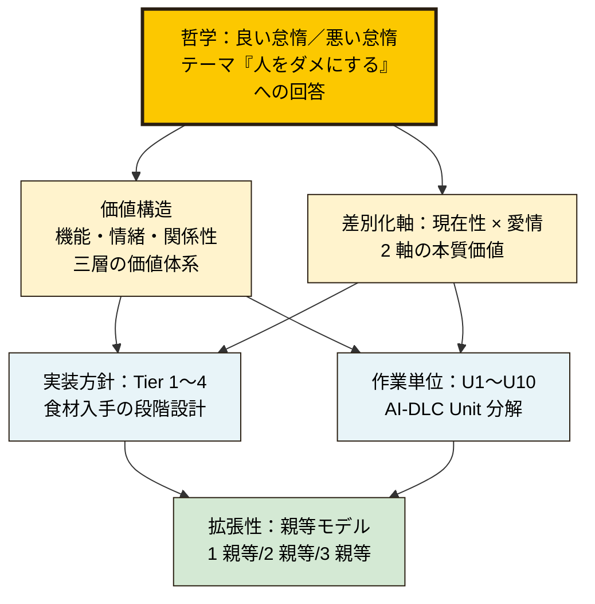

# うちごはん

> **サボるほど、食卓が笑う。**
> 思考はAIに、味付けは愛で。

AWS Summit Japan 2026 AI-DLC ハッカソン提出物（Inceptionフェーズ成果物）

---

## Why うちごはん

みなさん、子供との時間、もっと欲しくないですか？
家族との時間、両親との時間、作れていますか？
部下や先輩との時間、ちゃんと取れていますか？

家族との団欒は、プライスレス。
離れた両親を思いやれることは、親孝行。

これが、自動で集約できる「怠惰」なら ── 最高ですよね？

うちごはん。サボるほど、食卓が笑う。

---

## テーマ再解釈

本ハッカソンのテーマ「**人をダメにする**」を、私たちは「**サボらせる**」として再解釈しました。  
ダメにしていい部分（思考・選択・調整）と、ダメにしてはいけない部分（料理・食卓・愛情）を意図的に分けて設計します。

---

## サービス概要

**うちごはん** は、共働き家庭の「今日何作ろう」を考えなくするAIサービスです。  
LINE Botを入口に、家族の冷蔵庫・仕事疲労・体調をリアルタイムに統合して、その日のメニューを家族単位で提案します。

「考える」をAIに完全委譲し、「作る」と「食べる」を人間に残すことで、料理に込められる愛情を守ります。

---

## 設計思想：「良い怠惰」と「悪い怠惰」

```
┌─────────────────────────────────────────────────┐
│  AIに渡す（=良い怠惰）                            │
│  ・献立を考える、選ぶ、調整する                    │
│  ・在庫管理、栄養計算、買い物リスト生成            │
│  └ 認知労働（Cognitive Load）                     │
├─────────────────────────────────────────────────┤
│  人間に残す（=人をダメにしない）                   │
│  ・実際に作る、味見する、盛り付ける                │
│  ・食卓を囲む、話す、分かち合う                    │
│  └ 愛情と関係性（Care & Connection）              │
└─────────────────────────────────────────────────┘
```

ナッシュ等の冷凍宅配が「料理という愛情表現ごと外注する」のに対し、うちごはんは「**愛情表現の前段の摩擦だけを削る**」サービスです。手料理の温度はAIには再現できない、それは家族の心のケアそのものだから。

---

## 入力チャネル：LINE Bot 軸

第一選択は **LINE Messaging API**。日本国内の圧倒的リーチ、親世代でも使える日常UI、過去優勝のKanpAi(電話)と同じく**日常の通信路に侵入する**勝ちパターンを採ります。

- ユーザーは新しいアプリをインストールしない
- 親世代も既存のLINE体験のまま使える
- 発言・スタンプ・写真送信といった既存UIをそのまま機能ハンドルにできる

---

## ターゲットユーザー

主役：共働き世帯の30-40代（料理担当者）  
家族範囲：親等モデルで親世帯・兄弟まで自然に拡張可能

| 親等 | 公開範囲 | 用途 |
|---|---|---|
| 1親等（親・子） | 詳細閲覧（食事内容、薬、体調） | メニュー直接編集、見守り |
| 2親等（兄弟・祖父母） | サマリのみ | 介護負担分担可視化 |
| 3親等（叔父叔母等） | 安否情報のみ（緊急時通知のみ） | 軽い見守り |

---

## フレーム階層

うちごはんは複数のフレームを持ちますが、中核は **「良い怠惰／悪い怠惰」**
の哲学です。他のフレームはその哲学の異なる側面の具体化です。



各フレームの詳細は本ドキュメント群配下を参照ください。

---

## ファイル構成

| ファイル | 内容 |
|---|---|
| [README.md](./README.md) | 本ファイル |
| [01-requirements-analysis.md](./01-requirements-analysis.md) | 要件分析（背景・課題・価値提案・成功指標） |
| [02-user-stories.md](./02-user-stories.md) | ペルソナ3名 × ユーザーストーリー（ビフォー/アフター物語付き） |
| [03-application-design.md](./03-application-design.md) | アプリケーション設計（LINE Bot軸・Tier構造・AI×Human境界） |
| [04-unit-decomposition.md](./04-unit-decomposition.md) | Unit分解（10 Units、U10は意図的にAI比率0%） |
| [business-context.md](./business-context.md) | ビジネス文脈（競合・収益モデル・API規約・リスク） |

---

## フェーズロードマップ

| フェーズ | 期間 | スコープ | 成果物 |
|---|---|---|---|
| **Phase 1（書類審査）** | 〜5/10 | Inception成果物 | 本ドキュメント群 |
| **Phase 2（予選）** | 〜5/30 | MVP：LINE Bot + 献立疲労解消 + 親世帯食卓連動 | 動くMVP動画 |
| **Phase 3（決勝）** | 〜6/26 | 親等モデル全機能・栄養レポート | AWS本番デプロイ＋デモ |
| **Phase 4（事業化）** | 2026下期〜 | 楽天アフィリエイト連携／栄養士マーケット／月次レポート | プロダクト化 |

---

## チーム

- 構成：2名（IT企画 + エンジニア）
- 強み：プロンプト設計・Web/モバイルフロント・LLMエージェント設計
- 補完が必要：IoT/ハード自作（→ デモではモック化で回避）

---

## キャッチコピー体系

```
【メインキャッチ】 サボるほど、食卓が笑う。
【サブコピー】    思考はAIに、味付けは愛で。
【設計思想】      愛情を守る、良い怠惰。
```
